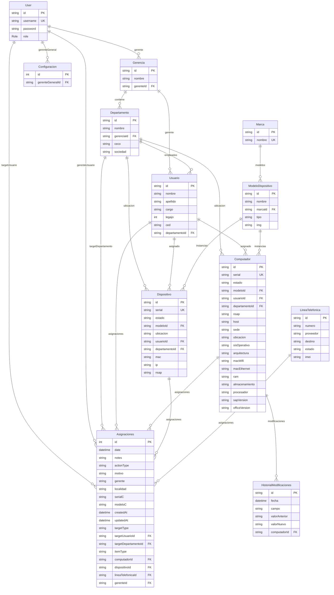

# Diagrama de Base de Datos - VENTORY

## Estructura de la Base de Datos

## Descripción de las Tablas

### 🔐 Autenticación
- **User**: Usuarios del sistema (admin, user roles)

### 🏢 Estructura Organizacional
- **Gerencia**: Gerencias de la empresa
- **Departamento**: Departamentos dentro de cada gerencia
- **Usuario**: Empleados de la empresa
- **Configuracion**: Configuración general del sistema

### 📱 Catálogo de Equipos
- **Marca**: Marcas de equipos (Dell, HP, Apple, etc.)
- **ModeloDispositivo**: Modelos específicos de cada marca

### 💻 Inventario de Equipos
- **Computador**: Computadoras con especificaciones técnicas
- **Dispositivo**: Otros dispositivos (monitores, impresoras, etc.)
- **LineaTelefonica**: Líneas telefónicas y móviles

### 📋 Gestión de Asignaciones
- **Asignaciones**: Historial de asignaciones de equipos (polimórfico)
- **HistorialModificaciones**: Cambios en especificaciones de computadores

## Características Especiales

### 🔄 Asignaciones Polimórficas
Las asignaciones pueden ser:
- **Item**: Computador, Dispositivo o LíneaTelefonica
- **Target**: Usuario o Departamento

### 📊 Campos Técnicos
Los computadores incluyen especificaciones detalladas:
- Hardware (RAM, procesador, almacenamiento)
- Red (MAC WiFi, Ethernet)
- Software (Sistema operativo, SAP, Office)

### 🏷️ Identificadores
- **Serial**: Identificador único de cada equipo
- **Legajo**: Número de empleado
- **CECO**: Centro de costo

